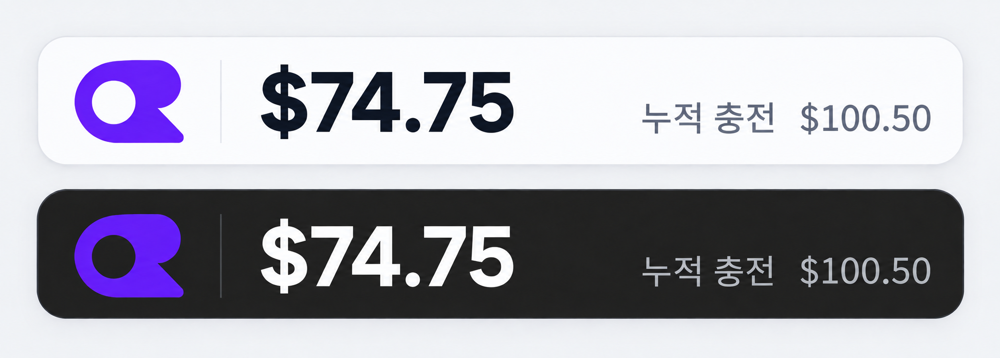

# OpenRouter Credits Widget

OpenRouter 계정의 현재 크레딧 잔액과 누적 충전액을 Android 홈 화면에서 확인하는 비공식 4×1 위젯 앱입니다.

An unofficial 4×1 Android home-screen widget that shows the current OpenRouter credit balance and cumulative credits purchased.

- [한국어](#한국어)
- [English](#english)
- [Design preview](#design-preview)

---

## 한국어

### 소개

OpenRouter Credits Widget은 OpenRouter API 키를 기기에 암호화해 저장하고, 다음 값을 홈 화면 위젯에 표시합니다.

- 현재 잔액: `max(total_credits - total_usage, 0)`
- 누적 충전액: `total_credits`

게이지나 비율 표시는 사용하지 않으며, 제한된 4×1 공간에서 현재 잔액을 가장 눈에 띄게 보여주는 데 집중합니다. 앱 본체는 WebView 대신 브라우저의 Custom Tabs를 사용하므로 Google OAuth와 기존 브라우저 로그인 세션을 이용할 수 있습니다.

이 프로젝트는 OpenRouter의 공식 앱이 아닙니다.

### 주요 기능

- 세로 1칸 × 가로 4칸으로 고정된 Android 홈 화면 위젯
- 좌측 OpenRouter 로고, 큰 현재 잔액, 작고 옅은 누적 충전액
- 시스템 라이트/다크 모드에 대응하는 위젯 배경과 텍스트
- 로고 터치 시 선택된 OpenRouter 페이지 실행
- 로고 이외의 위젯 영역 터치 시 즉시 새로고침 요청
- WorkManager를 이용한 15분~24시간 주기 자동 새로고침
- 크레딧, 로그, 활동 중 앱 시작 페이지 선택
- Custom Tabs 상단 메뉴의 `앱 설정` 항목
- Android Keystore와 AES-256-GCM을 이용한 API 키 암호화
- 네트워크 오류 시 마지막 성공 값을 보존하는 캐시

### 요구 환경

- Android 8.0(API 26) 이상
- JDK 17 이상
- Android SDK Platform 36.1
- 인터넷 연결
- 본인 OpenRouter 계정의 `sk-or-...` API 키
- Custom Tabs를 지원하는 브라우저 권장

프로젝트는 Gradle Wrapper 8.13, Android Gradle Plugin 8.13.0, Kotlin 2.1.21을 사용합니다.

### 빌드

Android Studio에서 프로젝트 루트를 열고 Gradle 동기화 후 `app` 구성을 실행하는 방법을 권장합니다.

Windows PowerShell에서 명령줄로 빌드하려면 JDK 17 이상이 선택되어 있어야 합니다.

```powershell
$env:JAVA_HOME = "C:\Program Files\Android\Android Studio\jbr"
.\gradlew.bat assembleDebug
```

디버그 APK의 기본 출력 위치는 다음과 같습니다.

```text
app/build/outputs/apk/debug/app-debug.apk
```

단위 테스트 실행:

```powershell
.\gradlew.bat testDebugUnitTest
```

API 키나 서명 정보는 저장소에 포함되어 있지 않습니다. 로컬 SDK 위치가 필요하면 Git에 포함되지 않는 `local.properties`에서 설정하십시오.

### 사용 방법

1. 앱을 실행합니다. 기본적으로 OpenRouter 크레딧 페이지가 Custom Tab으로 열립니다.
2. 상단 우측 `⋮` 메뉴에서 `앱 설정`을 선택합니다.
3. OpenRouter API 키를 입력하고 `확인 및 저장`을 누릅니다.
4. 자동 새로고침 주기와 시작 페이지를 선택합니다.
5. Android 위젯 선택 화면에서 **OpenRouter Credits** 위젯을 홈 화면에 추가합니다.
6. 위젯 본문을 누르면 새로고침하고, 좌측 로고를 누르면 앱을 실행합니다.

Android의 절전 및 백그라운드 실행 정책에 따라 자동 새로고침은 지정 시각보다 늦게 실행될 수 있습니다. 정확한 최신 값이 필요하면 위젯을 직접 누르십시오.

### API 동작

앱은 다음 요청만 사용합니다.

```http
GET https://openrouter.ai/api/v1/credits
Authorization: Bearer <api-key>
Accept: application/json
```

예상 응답 필드는 `data.total_credits`와 `data.total_usage`입니다. 금액 계산에는 이진 부동소수점 오차를 피하기 위해 `BigDecimal`을 사용합니다.

OpenRouter 공식 문서는 이 엔드포인트에 Management 키가 필요하다고 설명합니다. 다만 이 프로젝트가 참고한 실사용 구현에서는 일반 `sk-or-v1-...` 키로 자기 계정 조회가 가능했으므로 일반 키를 허용합니다. 서버가 403을 반환하면 저장 키와 마지막 성공 값은 삭제하지 않으며, 다른 키가 필요하다는 상태로 처리합니다.

### 보안 및 개인정보

- API 키 암호화 키는 Android Keystore에 비추출형 AES 키로 생성합니다.
- 앱 내부에는 AES-GCM의 IV와 암호문만 저장합니다.
- Android 백업을 비활성화해 저장 데이터가 기기 백업에 포함되지 않도록 합니다.
- 평문 HTTP를 차단하고 API 호스트를 `openrouter.ai`로 고정합니다.
- API 요청의 HTTP 리디렉션을 따르지 않아 Authorization 헤더의 외부 전달을 방지합니다.
- 키, Authorization 헤더, 쿠키 및 전체 API 응답을 로그에 기록하지 않습니다.
- 앱은 Custom Tab의 쿠키, Google 자격 증명, DOM 또는 입력 내용에 접근하지 않습니다.

401 응답은 저장된 키가 거부된 것으로 간주해 키와 해당 캐시를 삭제합니다. 403, 네트워크 오류, 429 및 서버 오류에서는 키를 보존합니다.

### 프로젝트 구조

```text
app/src/main/java/ai/openrouter/creditswidget/
├── data/       API, 암호화 키 저장소, DataStore 캐시, Repository
├── domain/     크레딧 모델, 키 정규화, 시작 페이지와 갱신 주기
├── ui/         Custom Tabs 실행기
├── widget/     Glance 위젯, Receiver, 터치 액션
├── worker/     WorkManager 작업과 스케줄러
├── MainActivity.kt
└── SettingsActivity.kt
```

세부 요구사항과 기술 결정은 [`PROJECT_PLAN.md`](PROJECT_PLAN.md)를 참고하십시오.

### 테스트 및 현재 상태

현재 포함된 JVM 단위 테스트는 다음을 검증합니다.

- 숫자 및 문자열 형태의 크레딧 응답 파싱
- 사용량이 충전액을 초과할 때 잔액을 0으로 제한
- 잘못된 API 응답 거부
- 붙여넣은 Authorization/Bearer 문자열 정규화
- 시작 페이지 URL과 WorkManager 최소 주기

현재 개발 환경에서 단위 테스트 4개와 Android 리소스 컴파일을 통과했습니다. 다만 실제 출시 전에는 다음 항목을 Android Studio와 실기기에서 추가 검증해야 합니다.

- 전체 Gradle 디버그/릴리스 빌드
- Google OAuth 로그인과 세션 유지
- Chrome 및 다른 Custom Tabs 브라우저
- 제조사별 런처의 4×1 크기, 글꼴 배율 및 터치 영역
- Doze와 배터리 최적화 상태의 WorkManager 동작
- 실제 일반 API 키와 권한 제한 키의 401/403 처리

---

## English

### Overview

OpenRouter Credits Widget stores an OpenRouter API key securely on the device and shows these values on the Android home screen:

- Current balance: `max(total_credits - total_usage, 0)`
- Cumulative credits purchased: `total_credits`

The widget intentionally omits gauges and percentages. Its fixed 4×1 layout gives the current balance the strongest visual emphasis. The app uses browser Custom Tabs instead of an embedded WebView, allowing Google OAuth and existing browser sessions to work normally.

This project is not an official OpenRouter application.

### Features

- Fixed four-column by one-row Android home-screen widget
- OpenRouter logo, prominent current balance, and muted cumulative credits
- Light and dark widget colors that follow the system theme
- Logo tap opens the selected OpenRouter page
- Tapping the rest of the widget requests an immediate refresh
- Periodic refresh intervals from 15 minutes to 24 hours using WorkManager
- Selectable startup page: Credits, Logs, or Activity
- Native `App settings` entry in the Custom Tabs overflow menu
- API-key encryption using Android Keystore and AES-256-GCM
- Last-successful-value cache retained during transient network failures

### Requirements

- Android 8.0 (API 26) or later
- JDK 17 or later
- Android SDK Platform 36.1
- Internet access
- An `sk-or-...` API key for your OpenRouter account
- A browser with Custom Tabs support is recommended

The project uses Gradle Wrapper 8.13, Android Gradle Plugin 8.13.0, and Kotlin 2.1.21.

### Build

The recommended workflow is to open the project root in Android Studio, let Gradle sync, and run the `app` configuration.

For a command-line build in Windows PowerShell, make sure JDK 17 or later is selected:

```powershell
$env:JAVA_HOME = "C:\Program Files\Android\Android Studio\jbr"
.\gradlew.bat assembleDebug
```

The debug APK is normally written to:

```text
app/build/outputs/apk/debug/app-debug.apk
```

Run JVM unit tests with:

```powershell
.\gradlew.bat testDebugUnitTest
```

No API keys or signing credentials are included in the repository. If a local SDK path is required, configure it in the Git-ignored `local.properties` file.

### Usage

1. Launch the app. It opens the OpenRouter Credits page in a Custom Tab by default.
2. Select `App settings` from the top-right `⋮` menu.
3. Enter an OpenRouter API key and tap the save button.
4. Choose the periodic refresh interval and startup page.
5. Add the **OpenRouter Credits** widget from the Android widget picker.
6. Tap the widget body to refresh, or tap the logo to open the app.

Periodic work may run later than the requested interval because of Android power-saving and background-execution policies. Tap the widget manually when an immediate value is required.

### API behavior

The app makes only the following OpenRouter API request:

```http
GET https://openrouter.ai/api/v1/credits
Authorization: Bearer <api-key>
Accept: application/json
```

It expects `data.total_credits` and `data.total_usage` in the response. Credit arithmetic uses `BigDecimal` to avoid binary floating-point errors.

OpenRouter's official documentation describes this endpoint as requiring a Management key. However, the real-world reference implementation used by this project successfully queried the owner's account with a regular `sk-or-v1-...` key, so regular keys are accepted. If the server returns 403, the app keeps both the saved key and the last successful snapshot and reports that another key may be required.

### Security and privacy

- The encryption key is generated as a non-exportable AES key in Android Keystore.
- Only the AES-GCM IV and ciphertext are stored in private app preferences.
- Android backup is disabled so stored app data is not included in device backups.
- Cleartext HTTP is disabled and API calls are restricted to `openrouter.ai`.
- HTTP redirects are disabled for the API call to prevent forwarding the Authorization header.
- API keys, Authorization headers, cookies, and complete API responses are never logged.
- The app cannot access Custom Tab cookies, Google credentials, page DOM, or form input.

A 401 response is treated as a rejected key and removes both the key and its cached snapshot. The key is retained for 403, network, rate-limit, and server errors.

### Project structure

```text
app/src/main/java/ai/openrouter/creditswidget/
├── data/       API, encrypted key storage, DataStore cache, repository
├── domain/     Credit model, key normalization, pages, refresh intervals
├── ui/         Custom Tabs launcher
├── widget/     Glance widget, receiver, and tap actions
├── worker/     WorkManager worker and scheduler
├── MainActivity.kt
└── SettingsActivity.kt
```

See [`PROJECT_PLAN.md`](PROJECT_PLAN.md) for detailed requirements and architecture decisions.

### Tests and project status

The included JVM tests currently cover:

- Credit response parsing from numbers and decimal strings
- Clamping the balance to zero when usage exceeds purchased credits
- Rejection of malformed API responses
- Normalization of pasted Authorization/Bearer strings
- Startup-page URLs and the minimum periodic interval

Four unit tests and Android resource compilation pass in the current development environment. Before release, the following items still require Android Studio and physical-device verification:

- Complete Gradle debug and release builds
- Google OAuth sign-in and session persistence
- Chrome and other Custom Tabs-capable browsers
- Fixed 4×1 sizing, font scaling, and tap targets across launcher vendors
- WorkManager behavior under Doze and battery optimization
- Real-account 401/403 behavior with regular and restricted API keys

---

## Design preview

The current approved light and dark widget concept is available at [`design/widget-concept-v2.png`](design/widget-concept-v2.png).


